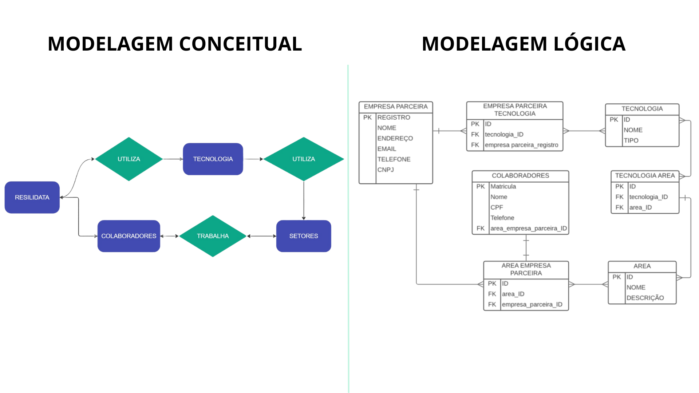

<h1 align= "center">
    
    
🎲Modelagem de dados.🎲

</h1> 

# 📝 Sobre:
O projeto individual módulo 3, tem o intuito de desenvolver um banco de dados que irá armazenar dados
importantes que será utilizado pelo sistema **RESILIADATA**. 

## 📊 Modelagem de dados:
A modelagem de dados é crucial para a compreensão e organização dos dados em um sistema. 

A **modelagem conceitual** define as entidades e seus relacionamentos, permitindo uma visão abstrata dos dados. 

A **modelagem lógica** traduz essa visão para um esquema de banco de dados, incluindo tabelas e restrições. 

A baixo podemos ver a elaboração das modelagens conceitual e lógica do projeto **RESILIDATA.** 

  

Já a **modelagem física** se concentra nos detalhes de implementação, como a escolha de tipos de dados e índices, visando à eficiência do armazenamento e acesso aos dados. Em conjunto, essas três etapas garantem a qualidade, a integridade e o desempenho do sistema de banco de dados. 

Podemos ver abaixo a representação da **modelagem física** a ultima etapa do projeto **RESILIDATA**.

 

 Segue o link da modelagem física feito na planilha Google Sheets:  ➡️ [Planilha RESILIDATA](https://docs.google.com/spreadsheets/d/12fAri9q6etjufaG1lIKrC9VIvJzATUYTP2onGEc4k-A/edit?usp=sharing)

## 🛠️ Ferramentas utilizadas:

- [Lucidchart](https://www.lucidchart.com/pages/pt)
- [Miro](https://miro.com/app/dashboard/)
- [Google Sheets](https://docs.google.com/spreadsheets/u/0/)
- [Ezgif](https://ezgif.com/)
- [Canva](https://www.canva.com/)
- [Vs Code](https://code.visualstudio.com/)

## 🪪 Autor:

Helder Fernadades Araujo de Sousa 

Contatos:
- [Linkedin](https://www.linkedin.com/in/helder-fernandes-data/)
- Email: helderfernandes00@gmail.com

